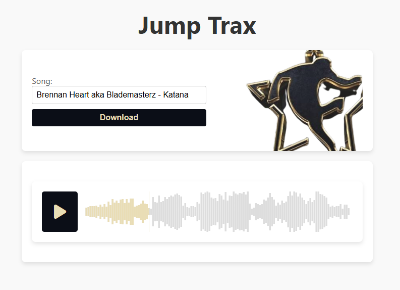

# track_id

An application to search for and download Jumpstyle tracks from online sources.

Built with React frontend + FastAPI backend + Selenium automation.



## How to run

### Backend (FastAPI):

```sh
cd server
pip install -r requirements.txt
uvicorn app:app --reload
```

Runs on: http://localhost:8000

### Frontend:

```sh
cd client
npm install
npm start
```

Runs on: http://localhost:3000

## Stack

React - frontend

FastAPI - backend REST API

Selenium - automation of download

Scrapy - for scraping track URLs

Wavesurfer - waveform player in React
